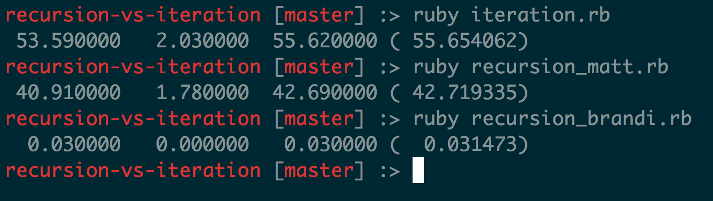

#Recursion vs Iteration

### Benchmark test for 3 methods

If you have never used benchmark before the main number you want to look at is the last one in parentheses. These show up float format by seconds. Brandi's solution is by far the fastest both for running the program and for coding the program.

Feel free to look at the solutions and see if you can follow the magic that we made happen!

###Pseudocode

-Input: Integer

-Output: Prime factors of the input

-Base Case: If number is less than or equal to 1

-Edge case: Number is already prime

### Matt
1. Find lowest factor

2. Store lowest factor

3. Divide the input by the lowest factor and store that

4. Repeat (Recusion)

### Brandi

1. Find all factors, which are numbers evenly divisible

2. Store those factors

3. Recurse with the found factors + recursion with a new number which is input divided by factor

